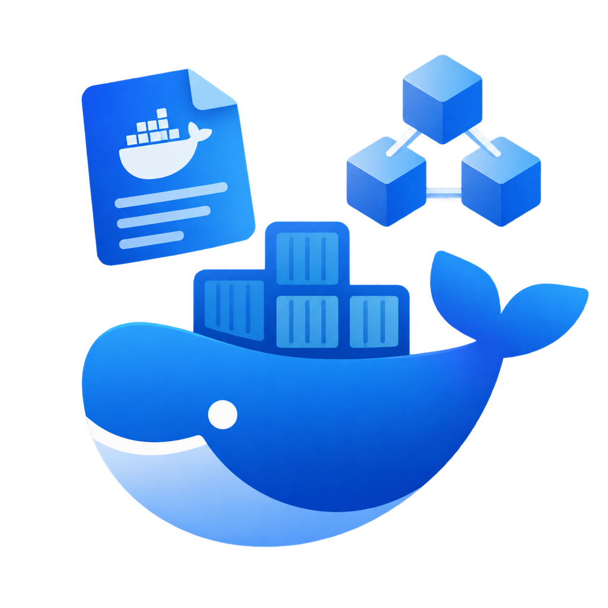

# 🐋 Dockeryzen

> **Automatic Dockerfile and Docker Compose build for multiple languages and frameworks.**

<!-- <div align="center">
  <table>
    <tr>
      <td align="center" style="background: linear-gradient(135deg, #667eea 0%, #764ba2 100%); padding: 20px; border-radius: 12px;">
        <h3 style="color: white; margin: 0;">🍃 Dynamic facet-based code generator for multiple languages and frameworks.</h3>
      </td>
    </tr>
  </table>
</div> -->

<!-- <div align="center">
  <div style="background-image: url('https://images.unsplash.com/photo-1555066931-4365d14bab8c?w=1200'); background-size: cover; background-position: center; padding: 40px; border-radius: 12px; position: relative;">
    <div style="background: rgba(0,0,0,0.7); padding: 20px; border-radius: 8px;">
      <h3 style="color: white; margin: 0;">🍃 Dynamic facet-based code generator for multiple languages and frameworks.</h3>
    </div>
  </div>
</div> -->

<!-- <div align="center">
  <div style="background: linear-gradient(135deg, #4A90E2 0%, #7B68EE 100%); padding: 30px; border-radius: 16px; box-shadow: 0 8px 32px rgba(0,0,0,0.2);">
    
    <h2 style="color: white; margin: 8px 0;">🍃 Code Facet Generator</h2>
    <p style="color: rgba(255,255,255,0.9); font-size: 16px; margin: 8px 0;">
      <strong>Dynamic facet-based code generator for multiple languages and frameworks.</strong>
    </p>
    <p style="color: rgba(255,255,255,0.7); font-size: 14px; margin: 4px 0;">
      ⚡ 327+ templates • 32 categories • 150+ tools
    </p>
  </div>
</div> -->

<!-- <div align="center">

<table>
<tr>
<td align="center" style="background: linear-gradient(135deg, #667eea 0%, #764ba2 100%); padding: 60px 40px; border-radius: 20px;">
  
  <h1 style="color: white; font-size: 36px; margin: 20px 0 10px 0;">🍃 Code Facet Generator</h1>
  <p style="color: rgba(255,255,255,0.95); font-size: 18px; margin: 10px 0;">
    <strong>Dynamic facet-based code generator for multiple languages and frameworks.</strong>
  </p>
  <div style="margin: 20px 0;">
    <span style="background: rgba(255,255,255,0.2); color: white; padding: 8px 16px; border-radius: 20px; margin: 4px; font-size: 14px;">⚡ 327+ Templates</span>
    <span style="background: rgba(255,255,255,0.2); color: white; padding: 8px 16px; border-radius: 20px; margin: 4px; font-size: 14px;">📦 32 Categories</span>
    <span style="background: rgba(255,255,255,0.2); color: white; padding: 8px 16px; border-radius: 20px; margin: 4px; font-size: 14px;">🛠️ 150+ Tools</span>
  </div>
  <div style="margin: 20px 0 0 0;">
    <a href="https://github.com/qewr1324/dockeryzen/stargazers">
      
    </a>
    <a href="LICENSE">
      
    </a>
  </div>
</td>
</tr>
</table> -->

</div>

---

<!-- Image & Icon -->
<div align="center">
  <a href="https://github.com/qewr1324/dockeryzen">
    
  </a>
  
  <h3>✨ Generate complete Docker configurations in minutes ✨</h3>

<!-- Static Badges -->

[](https://github.com/qewr1324/dockeryzen)
[](LICENSE)
[](#supported-languages--frameworks)

<!-- Dynamic GitHub Badges -->
<!-- [](https://github.com/qewr1324/dockeryzen/releases)
[](https://github.com/qewr1324/dockeryzen/releases)
[](https://github.com/qewr1324/dockeryzen/commits/main) -->

[](https://github.com/qewr1324/dockeryzen/stargazers)
[](https://github.com/qewr1324/dockeryzen/network/members)
[](https://github.com/qewr1324/dockeryzen/watchers)

<!-- [](https://github.com/qewr1324/dockeryzen/issues)
[](https://github.com/qewr1324/dockeryzen/pulls)
[](https://github.com/qewr1324/dockeryzen/issues?q=is%3Aissue+is%3Aclosed)
[](https://github.com/qewr1324/dockeryzen/pulls?q=is%3Apr+is%3Aclosed)

[](https://github.com/qewr1324/dockeryzen/graphs/contributors)
[](https://github.com/qewr1324/dockeryzen/commits/main)
[](https://github.com/qewr1324/dockeryzen/graphs/commit-activity)
[](https://github.com/qewr1324/dockeryzen) -->

[](https://github.com/qewr1324/dockeryzen)
[](https://github.com/qewr1324/dockeryzen)
[](https://github.com/qewr1324/dockeryzen)

<!-- CI/CD Badges -->
<!-- [](https://github.com/qewr1324/dockeryzen/actions)
[](https://github.com/qewr1324/dockeryzen/actions) -->

<!-- Marketplace Badges -->
<!-- [](https://marketplace.visualstudio.com/items?itemName=qewr1324.dockeryzen)
[](https://marketplace.visualstudio.com/items?itemName=qewr1324.dockeryzen)
[](https://marketplace.visualstudio.com/items?itemName=qewr1324.dockeryzen)
[](https://marketplace.visualstudio.com/items?itemName=qewr1324.dockeryzen) -->

<!-- Social -->
<!-- [](https://twitter.com/your-handle)
[](https://discord.gg/your-invite) -->

<!-- Iran -->
<!-- [](https://t.me/your-channel)
[](https://t.me/your-group)
[](https://ble.ir/your-channel)
[](https://ble.ir/your-group) -->

<!-- Donation -->
<!-- [](https://github.com/sponsors/user)
[](https://buymeacoffee.com/your-handle) -->

</div>

---

## 🎥 Demo

<div align="center">


</div>

---

## 📖 What is Dockeryzen?

> Dockeryzen is a powerful `VSCode extension` that eliminates the boilerplate of setting up Docker for your projects. It provides an interactive wizard to generate production-ready `Dockerfile`, `docker-compose.yml`, and other essential configuration files for a wide variety of programming languages, databases, and services.

## ✨ Features

- 🗺️ **Interactive Wizard** — A step-by-step guide to configure your entire Docker setup.
- 🚀 **Language & Framework Support** — Supports over 13 languages and their most popular frameworks.
- 🗄️ **Database Selection** — Easily add and configure 30+ databases (SQL, NoSQL, Vector, Time-Series, etc.).
- 📨 **Message Queues & Services** — Add message queues like Kafka, RabbitMQ and other services like Nginx or Grafana.
- ⚙️ **Smart Defaults** Automatically detects your project's language and suggests optimal configurations.
- 🔧 **Production-Ready Output**
    - Optimized multi-stage `Dockerfiles` with security and performance in mind.
    - Comprehensive `docker-compose.yml` with healthchecks, networks, and volumes.
    - Pre-configured `.dockerignore`, `.env.example`, and CI/CD pipelines (GitHub Actions & GitLab CI).
- 🧩 **Modular architecture** — Optionally enable remote debugging for your application.
- ❤️ **Health Checks** — Add health check endpoints to your services for better monitoring.
- 💾 **State Persistence** — our configuration state is saved automatically, so you can resume where you left off.

<!-- Marketplace Badges -->

[](https://marketplace.visualstudio.com/items?itemName=qewr1324.dockeryzen)
[](https://marketplace.visualstudio.com/items?itemName=qewr1324.dockeryzen)
[](https://marketplace.visualstudio.com/items?itemName=qewr1324.dockeryzen)
[](https://marketplace.visualstudio.com/items?itemName=qewr1324.dockeryzen)

---

## 📁 Project Structure

```text
dockeryzen/
├─ .bunfig.toml
├─ .npmrc
├─ LICENSE
├─ README.md
├─ bugs.txt
├─ bun.lock
├─ eslint.config.js
├─ package.json
├─ pnpm-workspace.yaml
├─ res/
│  ├─ dockeryzen-icon-big.png
│  ├─ facet-icon-big.svg
│  ├─ review.gif
│  └─ review.mp4
├─ scripts/
│  └─ clean-generated-meta.mjs
├─ shared/
│  └─ versions.ts
├─ src/
│  ├─ config/
│  │  ├─ databases/
│  │  │  ├─ graph.json
│  │  │  ├─ key-value.json
│  │  │  ├─ newsql.json
│  │  │  ├─ nosql.json
│  │  │  ├─ search-engines.json
│  │  │  ├─ sql.json
│  │  │  ├─ time-series.json
│  │  │  ├─ vector.json
│  │  │  └─ wide-column.json
│  │  ├─ languages/
│  │  │  ├─ c.json
│  │  │  ├─ cpp.json
│  │  │  ├─ dotnet.json
│  │  │  ├─ go.json
│  │  │  ├─ java.json
│  │  │  ├─ nodejs.json
│  │  │  ├─ php.json
│  │  │  ├─ python.json
│  │  │  ├─ ruby.json
│  │  │  └─ rust.json
│  │  ├─ message-queues.json
│  │  └─ services.json
│  ├─ extension.ts
│  ├─ generators/
│  │  ├─ DockerComposeGenerator.ts
│  │  ├─ DockerComposeOverrideGenerator.ts
│  │  ├─ DockerfileGenerator.ts
│  │  ├─ DockerignoreGenerator.ts
│  │  ├─ EnvFileGenerator.ts
│  │  ├─ GitHubWorkflowGenerator.ts
│  │  ├─ GitLabCIGenerator.ts
│  │  ├─ NginxConfigGenerator.ts
│  │  └─ PrometheusConfigGenerator.ts
│  ├─ managers/
│  │  ├─ DatabaseManager.ts
│  │  ├─ MessageQueueManager.ts
│  │  └─ ServiceManager.ts
│  ├─ types/
│  │  └─ index.ts
│  ├─ utils/
│  │  └─ helpers.ts
│  └─ wizard/
│     └─ DockerWizard.ts
├─ taze.config.ts
├─ test/
│  └─ index.test.ts
├─ tsconfig.json
└─ tsdown.config.ts
```

---

## 🚀 Supported Languages & Frameworks

<details>
<summary><b>Dockeryzen can generate configurations for a wide array of technologies. Here are some of the key languages and frameworks supported:</b></summary>

| Category         | Languages / Frameworks   |
| ---------------- | ------------------------ |
| ☕ Java          | `pom.xml`                |
| 💛 JavaScript/TS | `build.gradle`           |
| 🐍 Python        | `persistence.xml`        |
| ✨ Go            | `hibernate.cfg.xml`      |
| 🦀 Rust          | `application.yml`        |
| 🔷 C# / .NET     | `application.properties` |
| 🧩 PHP           | `application.yml`        |
| 💎 Ruby          | `mybatis-config.xml`     |
| ⚙️ C/C++         | `web.xml`                |

</details>

---

🗄️ Supported Databases & Services

> You can easily integrate a wide range of databases and services into your Docker Compose setup.

- **Databases (30+):**

- `SQL`: PostgreSQL, MySQL, MariaDB, Oracle, MSSQL, IBM Db2

- `NoSQL`: MongoDB, CouchDB, Couchbase, DynamoDB, RavenDB

- `Key-Value`: Redis, Memcached, etcd, Aerospike

- `Wide-Column`: Cassandra, ScyllaDB, HBase, Bigtable

- `Graph`: Neo4j, ArangoDB, JanusGraph, Dgraph

- `NewSQL`: CockroachDB, TiDB, YugabyteDB

- `Time-Series`: InfluxDB, TimescaleDB, Prometheus, OpenTSDB

- `Search Engine`: Elasticsearch, Solr, Meilisearch, Typesense

- `Vector (AI/ML)`: Weaviate, Qdrant, Milvus, Chroma

- **Message Queues & Services:**

- `Message Queues`: Kafka, RabbitMQ, ActiveMQ Classic, ActiveMQ Artemis

- `Services`: Nginx, Grafana, Prometheus, Keycloak, MinIO, and more.

---

## 🔧 How to Use

1. Open your project in VS Code.
2. Open the Command Palette (`Ctrl+Shift+P` or `Cmd+Shift+P`) and search for `Dockeryzen: Generate`.
3. A wizard will guide you through the following steps:
    - Project Name: Set the name for your project.
    - Language: Select your project's language (auto-detected).
    - Application Port: Define the port your app will run on.
    - General Options: Choose options like Alpine base images, Debug mode, and Health Checks.
    - Language-Specific Settings: Configure your build tools, JDK version, frameworks, etc.
    - Databases: Select and configure any databases you need.
    - Message Queues: Select and configure any message queues.
    - Services: Select and configure any additional services.

4. The extension will automatically generate all required configuration files in your workspace.

### Example: Generating a `pom.xml`

- Click: Java → Maven → 4.0
- Generated: ./pom.xml

### Example: Generating an `application.yml`

- Click: Java → Spring Boot → 3.2
- Generated: ./src/main/resources/application.yml

---

## ⚙️ Configuration

> You can customize the default behavior of Dockeryzen via VS Code settings.

1. Open the Command Palette (Ctrl+Shift+P or Cmd+Shift+P).

2. Search for Dockeryzen: Open Settings.

Some of the available settings include:

- `dockeryzen.defaultPort`: The default port for the application.
- `dockeryzen.useAlpineByDefault`: Whether to use Alpine-based images by default.
- `dockeryzen.enableHealthCheckByDefault`: Whether to enable health checks by default.
- `dockeryzen.enableDebugByDefault`: Whether to enable debug mode by default.
- `dockeryzen.debugPort`: The debug port to use for applications.
- `dockeryzen.generateDockerignore`: If `false`, it will not generate a `.dockerignore` file.

---

## 🛠️ Development

> Want to contribute or build the extension yourself? Here’s how to get started.

```bash
# Clone the repository
git clone https://github.com/qewr1324/dockeryzen.git

# Navigate to the project directory
cd dockeryzen

# Install dependencies (using bun is recommended)
bun install
# or
npm install

# Build the extension
bun run build
# or
npm run build

# Run the extension in a new VS Code window
# Press F5 in VS Code after opening the project
```

# 📝 License

- MIT © [GhurbeSABZI](https://github.com/qewr1324)

# 🤝 Contributing

[](https://github.com/qewr1324/dockeryzen/issues)
[](https://github.com/qewr1324/dockeryzen/pulls)
[](https://github.com/qewr1324/dockeryzen/issues?q=is%3Aissue+is%3Aclosed)
[](https://github.com/qewr1324/dockeryzen/pulls?q=is%3Apr+is%3Aclosed)

[](https://github.com/qewr1324/dockeryzen/graphs/contributors)
[](https://github.com/qewr1324/dockeryzen/commits/main)
[](https://github.com/qewr1324/dockeryzen/graphs/commit-activity)
[](https://github.com/qewr1324/dockeryzen)

> Contributions are what make the open-source community such an amazing place to learn, inspire, and create. Any contributions you make are `greatly appreciated`. Check out the issues page to see where you can help.

<!-- # ⭐ Support

> If you find this useful, please star the repo and share it with your friends! -->

<!-- Donation -->
<!-- [](https://github.com/sponsors/user)
[](https://buymeacoffee.com/your-handle) -->

<!-- Social -->
<!-- [](https://twitter.com/your-handle)
[](https://discord.gg/your-invite) -->

<!-- Iran -->
<!-- [](https://t.me/your-channel)
[](https://t.me/your-group)
[](https://ble.ir/your-channel)
[](https://ble.ir/your-group) -->

<p align="center">Made with ❤️ for developers who value their time.</p>
